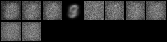
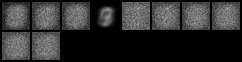
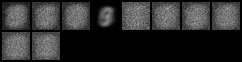
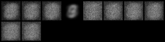
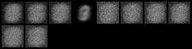
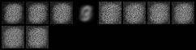

```python
import torch
import torch.nn as nn
from torch.autograd import Variable
import numpy as np
import torch.optim as optim
import torch.nn.functional as F
import matplotlib.pyplot as plt
import torch.utils.data

# set up the VQ class 
class VQ(torch.autograd.Function):
    @staticmethod
    def forward(ctx, x, emb):
       
        dist = E_distance(x, emb)
        indices = torch.min(dist, -1)[1]
        ctx.indices = indices
        ctx.emb_num = emb.size(0)
        ctx.b_size = x.size(0)
        return torch.index_select(emb, 0, indices)

    @staticmethod
    def backward(ctx, grad_output):
        indices = ctx.indices.view(-1,1)
        b_size = ctx.b_size
        emb_num = ctx.emb_num

        # get a one hot index
        one_hot_ind = torch.zeros(b_size, emb_num)
        one_hot_ind.scatter_(1, indices, 1)
        one_hot_ind = Variable(one_hot_ind, requires_grad=False)
        grad_emb = torch.mm(one_hot_ind.t(), grad_output)
        return grad_output, grad_emb


class Embediing_layer(nn.Module):
    def __init__(self, D, K):
        super(Embediing_layer, self).__init__()
        self.emb = nn.Embedding(K, D)
        self.K = K
        self.D = D

    def forward(self, x):
     
        return VQ.apply(x, self.emb.weight)
def E_distance(x1, x2):
  
    a = x1.size(0)
    b = x2.size(0)
    d1 = torch.stack([x1]*b).transpose(0,1)
    d2 = torch.stack([x2]*a)
    distance=torch.sum((d1-d2)**2, 2).squeeze()
    return distance
 
class VQVAE(nn.Module):
    def __init__(self, emb_dim, emb_num):
        super(VQVAE, self).__init__()
       
        self.layer = Embediing_layer(D=emb_dim,K=emb_num)

        self.fc1 = nn.Linear(784, 400)
        self.fc2 = nn.Linear(400, emb_dim)
        self.fc3 = nn.Linear(emb_dim, 400)
        self.fc4 = nn.Linear(400, 784)


        self.relu = nn.ReLU()
        self.sigmoid = nn.Sigmoid()
    def encoder(self, x):
        h1 =   self.relu(self.fc1(x))
        h2=self.fc2(h1)
        return h2
    def decoder(self, z):
        h3 = self.relu(self.fc3(z))
        return self.sigmoid(self.fc4(h3))
    def forward(self, x):
        self.z_e = self.encoder(x)
        self.z_q = self.layer(self.z_e)
        self.x_reconst = self.decoder(self.z_q)
        return self.x_reconst
 
    
    def sample_from_modes(self):
       
        zq = self.layer.emb.weight
        samples = self.decoder(zq)
        return samples
    


```


```python
from __future__ import print_function
import argparse
import torch
import torch.utils.data
from torch import nn, optim
from torch.autograd import Variable
from torch.nn import functional as F
from torchvision import datasets, transforms
from torchvision.utils import save_image


parser = argparse.ArgumentParser(description='VAE MNIST Example')
parser.add_argument('--batch-size', type=int, default=128, metavar='N',
                    help='input batch size for training (default: 128)')
parser.add_argument('--epochs', type=int, default=10, metavar='N',
                    help='number of epochs to train (default: 10)')
parser.add_argument('--no-cuda', action='store_true', default=False,
                    help='enables CUDA training')
parser.add_argument('--seed', type=int, default=1, metavar='S',
                    help='random seed (default: 1)')
parser.add_argument('--log-interval', type=int, default=10, metavar='N',
                    help='how many batches to wait before logging training status')
parser.add_argument('--emb-dim', default=500, type=int)
parser.add_argument('--emb-num', default=10, type=int)
parser.add_argument('--beta', default=0.25, type=float)

args = parser.parse_args(args=[])
args.cuda = not args.no_cuda and torch.cuda.is_available()


torch.manual_seed(args.seed)
if args.cuda:
    torch.cuda.manual_seed(args.seed)


kwargs = {'num_workers': 1, 'pin_memory': True} if args.cuda else {}
train_loader = torch.utils.data.DataLoader(
    datasets.MNIST('./data', train=True, download=True,
                   transform=transforms.ToTensor()),
    batch_size=args.batch_size, shuffle=True, **kwargs)
test_loader = torch.utils.data.DataLoader(
    datasets.MNIST('./data', train=False, transform=transforms.ToTensor()),
    batch_size=args.batch_size, shuffle=True, **kwargs)


```


```python


vqvae = VQVAE(args.emb_dim, args.emb_num)
if args.cuda:
    vqvae.cuda()

optimizer = optim.Adam(vqvae.parameters(), lr=1e-3)


```


```python
def get_loss(data, vqvae):
    recon_data = vqvae(data)

    # reconst loss
    reconst_loss = F.binary_cross_entropy(recon_data, data)

    # cluster assignment loss
    detach_z_q = Variable(vqvae.z_q.data, requires_grad=False)
    cls_assg_loss = torch.sum((vqvae.z_e - detach_z_q).pow(2))
    cls_assg_loss /= args.batch_size

    # cluster update loss
    detach_z_e = Variable(vqvae.z_e.data, requires_grad=False)
    z_q = vqvae.layer(detach_z_e)
    cls_dist_loss = torch.sum((detach_z_e - z_q).pow(2))
    cls_dist_loss /= args.batch_size

    return reconst_loss, cls_assg_loss, cls_dist_loss

def train(epoch):
    vqvae.train()
    train_loss = 0
    for batch_idx, (data, _) in enumerate(train_loader):
        data = Variable(data)
        data = data.view(-1, 784)
        if args.cuda:
            data = data.cuda()

        # get losses
        reconst_loss, cls_assg_loss, cls_dist_loss = get_loss(data, vqvae)

        optimizer.zero_grad()
        # get grad for dec and enc
        loss = reconst_loss + args.beta * cls_assg_loss
        loss.backward()

        # clear the grads in vqlayer because they are not grads for updating emb
        vqvae.layer.emb.zero_grad()
        # cluster update loss
        cls_dist_loss.backward() # get grad in emb
        loss += cls_dist_loss

        # all grads good. Update
        optimizer.step()
        train_loss += loss.data[0]
        if batch_idx % args.log_interval == 0:
            print('Train Epoch: {} [{}/{} ({:.0f}%)]\tLoss: {:.6f}'.format(
                epoch, batch_idx * len(data), len(train_loader.dataset),
                100. * batch_idx / len(train_loader),
                loss.data[0] / len(data)))

    print('====> Epoch: {} Average loss: {:.4f}'.format(
          epoch, train_loss / len(train_loader.dataset)))
def test(epoch):
    vqvae.eval()
    test_loss = 0
    for i, (data, _) in enumerate(test_loader):
        if args.cuda:
            data = data.cuda()
        data = Variable(data, volatile=True)
        data = data.view(-1, 784)

        reconst_loss, cls_assg_loss, cls_dist_loss = get_loss(data, vqvae)
        test_loss += \
            (reconst_loss + args.beta*cls_assg_loss + cls_dist_loss).data[0]

    test_loss /= len(test_loader.dataset)
    print('====> Test set loss: {:.4f}'.format(test_loss))

```


```python
for epoch in range(1, args.epochs + 1):
    train(epoch)
    test(epoch)

    # sample from each of discrete vector
    
    samples = vqvae.sample_from_modes()
    print (samples.data.view(args.emb_num, 1, 28, 28))
    
    save_image(samples.data.view(args.emb_num, 1, 28, 28),
               '/Users/tangjiaqi/Downloads/sample_'+ str(epoch) + '.png')
```

    Train Epoch: 1 [0/60000 (0%)]	Loss: 4.450305
    Train Epoch: 1 [1280/60000 (2%)]	Loss: 0.651962
    Train Epoch: 1 [2560/60000 (4%)]	Loss: 0.386080
    Train Epoch: 1 [3840/60000 (6%)]	Loss: 0.294798
    Train Epoch: 1 [5120/60000 (9%)]	Loss: 0.225313
    Train Epoch: 1 [6400/60000 (11%)]	Loss: 0.209036
    Train Epoch: 1 [7680/60000 (13%)]	Loss: 0.172693
    Train Epoch: 1 [8960/60000 (15%)]	Loss: 0.203026
    Train Epoch: 1 [10240/60000 (17%)]	Loss: 0.158017
    Train Epoch: 1 [11520/60000 (19%)]	Loss: 0.139585
    Train Epoch: 1 [12800/60000 (21%)]	Loss: 0.125459
    Train Epoch: 1 [14080/60000 (23%)]	Loss: 0.111927
    Train Epoch: 1 [15360/60000 (26%)]	Loss: 0.081161
    Train Epoch: 1 [16640/60000 (28%)]	Loss: 0.077838
    Train Epoch: 1 [17920/60000 (30%)]	Loss: 0.064036
    Train Epoch: 1 [19200/60000 (32%)]	Loss: 0.065615
    Train Epoch: 1 [20480/60000 (34%)]	Loss: 0.064956
    Train Epoch: 1 [21760/60000 (36%)]	Loss: 0.054067
    Train Epoch: 1 [23040/60000 (38%)]	Loss: 0.046697
    Train Epoch: 1 [24320/60000 (41%)]	Loss: 0.047687
    Train Epoch: 1 [25600/60000 (43%)]	Loss: 0.043857
    Train Epoch: 1 [26880/60000 (45%)]	Loss: 0.039800
    Train Epoch: 1 [28160/60000 (47%)]	Loss: 0.027930
    Train Epoch: 1 [29440/60000 (49%)]	Loss: 0.024376
    Train Epoch: 1 [30720/60000 (51%)]	Loss: 0.022525
    Train Epoch: 1 [32000/60000 (53%)]	Loss: 0.018808
    Train Epoch: 1 [33280/60000 (55%)]	Loss: 0.021006
    Train Epoch: 1 [34560/60000 (58%)]	Loss: 0.020263
    Train Epoch: 1 [35840/60000 (60%)]	Loss: 0.019055
    Train Epoch: 1 [37120/60000 (62%)]	Loss: 0.018700
    Train Epoch: 1 [38400/60000 (64%)]	Loss: 0.017360
    Train Epoch: 1 [39680/60000 (66%)]	Loss: 0.016566
    Train Epoch: 1 [40960/60000 (68%)]	Loss: 0.011134
    Train Epoch: 1 [42240/60000 (70%)]	Loss: 0.017116
    Train Epoch: 1 [43520/60000 (72%)]	Loss: 0.012371
    Train Epoch: 1 [44800/60000 (75%)]	Loss: 0.010968
    Train Epoch: 1 [46080/60000 (77%)]	Loss: 0.012734
    Train Epoch: 1 [47360/60000 (79%)]	Loss: 0.010336
    Train Epoch: 1 [48640/60000 (81%)]	Loss: 0.011375
    Train Epoch: 1 [49920/60000 (83%)]	Loss: 0.009526
    Train Epoch: 1 [51200/60000 (85%)]	Loss: 0.011996
    Train Epoch: 1 [52480/60000 (87%)]	Loss: 0.010579
    Train Epoch: 1 [53760/60000 (90%)]	Loss: 0.008833
    Train Epoch: 1 [55040/60000 (92%)]	Loss: 0.008326
    Train Epoch: 1 [56320/60000 (94%)]	Loss: 0.011663
    Train Epoch: 1 [57600/60000 (96%)]	Loss: 0.009793
    Train Epoch: 1 [58880/60000 (98%)]	Loss: 0.008721
    ====> Epoch: 1 Average loss: 0.1190
    ====> Test set loss: 0.0076
    
    (0 ,0 ,.,.) = 
      0.2449  0.2011  0.1670  ...   0.2142  0.2331  0.2429
      0.1697  0.2117  0.1575  ...   0.1560  0.1863  0.1811
      0.1601  0.2423  0.2095  ...   0.2311  0.2673  0.2310
               ...             ⋱             ...          
      0.1865  0.2290  0.2707  ...   0.3222  0.2558  0.1183
      0.1697  0.2475  0.2709  ...   0.2277  0.2529  0.2519
      0.2187  0.2253  0.2101  ...   0.1480  0.2266  0.1524
         ⋮ 
    
    (1 ,0 ,.,.) = 
      0.3029  0.2746  0.2162  ...   0.2193  0.2684  0.2921
      0.2339  0.2629  0.2824  ...   0.3127  0.2816  0.2349
      0.3334  0.3234  0.2446  ...   0.2760  0.3019  0.2854
               ...             ⋱             ...          
      0.3095  0.2253  0.3419  ...   0.2265  0.3345  0.2338
      0.2698  0.2194  0.2905  ...   0.3517  0.3689  0.2635
      0.2560  0.2242  0.3679  ...   0.2713  0.2483  0.2806
         ⋮ 
    
    (2 ,0 ,.,.) = 
      0.3189  0.2502  0.2135  ...   0.2489  0.2280  0.2842
      0.2729  0.2837  0.2497  ...   0.1955  0.2694  0.2744
      0.3099  0.2794  0.2098  ...   0.2988  0.2530  0.2746
               ...             ⋱             ...          
      0.3038  0.3295  0.2987  ...   0.2992  0.2581  0.2552
      0.2858  0.2432  0.2980  ...   0.2730  0.3065  0.3894
      0.2877  0.2843  0.2284  ...   0.2699  0.2781  0.2637
    ...   
         ⋮ 
    
    (7 ,0 ,.,.) = 
      0.3260  0.2696  0.2055  ...   0.2405  0.3477  0.3403
      0.2839  0.4093  0.2819  ...   0.2439  0.3415  0.3502
      0.3875  0.2532  0.2478  ...   0.4089  0.3164  0.3100
               ...             ⋱             ...          
      0.2668  0.3696  0.4683  ...   0.3667  0.3871  0.2402
      0.3413  0.2848  0.3244  ...   0.3060  0.4292  0.3102
      0.3091  0.3853  0.3927  ...   0.2869  0.2720  0.3459
         ⋮ 
    
    (8 ,0 ,.,.) = 
      0.3919  0.3403  0.2771  ...   0.3188  0.3279  0.3733
      0.3362  0.4071  0.2572  ...   0.3084  0.3442  0.3325
      0.3148  0.3237  0.3192  ...   0.3777  0.3370  0.3778
               ...             ⋱             ...          
      0.4103  0.2921  0.3761  ...   0.3433  0.3111  0.2785
      0.3078  0.3121  0.4290  ...   0.3689  0.4075  0.4143
      0.4223  0.3817  0.3981  ...   0.2478  0.3052  0.3001
         ⋮ 
    
    (9 ,0 ,.,.) = 
      0.3944  0.3512  0.4176  ...   0.4250  0.3884  0.4078
      0.2974  0.3567  0.3058  ...   0.2932  0.4168  0.3427
      0.3350  0.3979  0.4000  ...   0.3291  0.3528  0.3877
               ...             ⋱             ...          
      0.3969  0.3041  0.3947  ...   0.4251  0.4477  0.2715
      0.2902  0.2804  0.3844  ...   0.3259  0.5108  0.3413
      0.3730  0.3128  0.4338  ...   0.2698  0.3381  0.4180
    [torch.FloatTensor of size 10x1x28x28]
    
    Train Epoch: 2 [0/60000 (0%)]	Loss: 0.008587
    Train Epoch: 2 [1280/60000 (2%)]	Loss: 0.006643
    Train Epoch: 2 [2560/60000 (4%)]	Loss: 0.006456
    Train Epoch: 2 [3840/60000 (6%)]	Loss: 0.006570
    Train Epoch: 2 [5120/60000 (9%)]	Loss: 0.006390
    Train Epoch: 2 [6400/60000 (11%)]	Loss: 0.007053
    Train Epoch: 2 [7680/60000 (13%)]	Loss: 0.005993
    Train Epoch: 2 [8960/60000 (15%)]	Loss: 0.009776
    Train Epoch: 2 [10240/60000 (17%)]	Loss: 0.006646
    Train Epoch: 2 [11520/60000 (19%)]	Loss: 0.006369
    Train Epoch: 2 [12800/60000 (21%)]	Loss: 0.006045
    Train Epoch: 2 [14080/60000 (23%)]	Loss: 0.005569
    Train Epoch: 2 [15360/60000 (26%)]	Loss: 0.007508
    Train Epoch: 2 [16640/60000 (28%)]	Loss: 0.005480
    Train Epoch: 2 [17920/60000 (30%)]	Loss: 0.005853
    Train Epoch: 2 [19200/60000 (32%)]	Loss: 0.005854
    Train Epoch: 2 [20480/60000 (34%)]	Loss: 0.005154
    Train Epoch: 2 [21760/60000 (36%)]	Loss: 0.005153
    Train Epoch: 2 [23040/60000 (38%)]	Loss: 0.005302
    Train Epoch: 2 [24320/60000 (41%)]	Loss: 0.006520
    Train Epoch: 2 [25600/60000 (43%)]	Loss: 0.005831
    Train Epoch: 2 [26880/60000 (45%)]	Loss: 0.005300
    Train Epoch: 2 [28160/60000 (47%)]	Loss: 0.005881
    Train Epoch: 2 [29440/60000 (49%)]	Loss: 0.005955
    Train Epoch: 2 [30720/60000 (51%)]	Loss: 0.005576
    Train Epoch: 2 [32000/60000 (53%)]	Loss: 0.004995
    Train Epoch: 2 [33280/60000 (55%)]	Loss: 0.004631
    Train Epoch: 2 [34560/60000 (58%)]	Loss: 0.004300
    Train Epoch: 2 [35840/60000 (60%)]	Loss: 0.004991
    Train Epoch: 2 [37120/60000 (62%)]	Loss: 0.004721
    Train Epoch: 2 [38400/60000 (64%)]	Loss: 0.006901
    Train Epoch: 2 [39680/60000 (66%)]	Loss: 0.005730
    Train Epoch: 2 [40960/60000 (68%)]	Loss: 0.005422
    Train Epoch: 2 [42240/60000 (70%)]	Loss: 0.004632
    Train Epoch: 2 [43520/60000 (72%)]	Loss: 0.004502
    Train Epoch: 2 [44800/60000 (75%)]	Loss: 0.004349
    Train Epoch: 2 [46080/60000 (77%)]	Loss: 0.004589
    Train Epoch: 2 [47360/60000 (79%)]	Loss: 0.004229
    Train Epoch: 2 [48640/60000 (81%)]	Loss: 0.004329
    Train Epoch: 2 [49920/60000 (83%)]	Loss: 0.003792
    Train Epoch: 2 [51200/60000 (85%)]	Loss: 0.004197
    Train Epoch: 2 [52480/60000 (87%)]	Loss: 0.004930
    Train Epoch: 2 [53760/60000 (90%)]	Loss: 0.003967
    Train Epoch: 2 [55040/60000 (92%)]	Loss: 0.004679
    Train Epoch: 2 [56320/60000 (94%)]	Loss: 0.004059
    Train Epoch: 2 [57600/60000 (96%)]	Loss: 0.004931
    Train Epoch: 2 [58880/60000 (98%)]	Loss: 0.005164
    ====> Epoch: 2 Average loss: 0.0054
    ====> Test set loss: 0.0043
    
    (0 ,0 ,.,.) = 
      0.1949  0.1608  0.1317  ...   0.1701  0.1897  0.1985
      0.1385  0.1732  0.1259  ...   0.1223  0.1493  0.1457
      0.1279  0.1967  0.1677  ...   0.1874  0.2179  0.1845
               ...             ⋱             ...          
      0.1479  0.1831  0.2222  ...   0.2619  0.2089  0.0925
      0.1358  0.1985  0.2195  ...   0.1883  0.2086  0.2027
      0.1754  0.1807  0.1716  ...   0.1162  0.1792  0.1209
         ⋮ 
    
    (1 ,0 ,.,.) = 
      0.2485  0.2250  0.1733  ...   0.1763  0.2235  0.2428
      0.1940  0.2180  0.2327  ...   0.2572  0.2323  0.1910
      0.2785  0.2722  0.2023  ...   0.2286  0.2510  0.2351
               ...             ⋱             ...          
      0.2558  0.1831  0.2867  ...   0.1841  0.2820  0.1878
      0.2210  0.1790  0.2412  ...   0.2996  0.3126  0.2154
      0.2104  0.1825  0.3136  ...   0.2213  0.2008  0.2300
         ⋮ 
    
    (2 ,0 ,.,.) = 
      0.2644  0.2044  0.1722  ...   0.2025  0.1891  0.2361
      0.2292  0.2373  0.2059  ...   0.1575  0.2225  0.2264
      0.2576  0.2339  0.1728  ...   0.2505  0.2079  0.2263
               ...             ⋱             ...          
      0.2513  0.2753  0.2490  ...   0.2482  0.2144  0.2067
      0.2368  0.1997  0.2477  ...   0.2300  0.2579  0.3297
      0.2384  0.2352  0.1889  ...   0.2216  0.2274  0.2165
    ...   
         ⋮ 
    
    (7 ,0 ,.,.) = 
      0.2779  0.2276  0.1700  ...   0.2006  0.3026  0.2937
      0.2451  0.3606  0.2398  ...   0.2044  0.2940  0.3013
      0.3363  0.2164  0.2113  ...   0.3587  0.2711  0.2649
               ...             ⋱             ...          
      0.2253  0.3189  0.4153  ...   0.3167  0.3386  0.2000
      0.2935  0.2425  0.2788  ...   0.2650  0.3785  0.2644
      0.2642  0.3346  0.3446  ...   0.2429  0.2285  0.2969
         ⋮ 
    
    (8 ,0 ,.,.) = 
      0.3456  0.2976  0.2381  ...   0.2763  0.2901  0.3305
      0.2988  0.3647  0.2224  ...   0.2676  0.3023  0.2909
      0.2746  0.2862  0.2817  ...   0.3355  0.2955  0.3335
               ...             ⋱             ...          
      0.3636  0.2533  0.3336  ...   0.3011  0.2734  0.2391
      0.2684  0.2726  0.3838  ...   0.3296  0.3643  0.3678
      0.3764  0.3375  0.3562  ...   0.2127  0.2638  0.2607
         ⋮ 
    
    (9 ,0 ,.,.) = 
      0.3445  0.3044  0.3667  ...   0.3730  0.3450  0.3596
      0.2594  0.3146  0.2629  ...   0.2514  0.3661  0.2969
      0.2907  0.3545  0.3565  ...   0.2849  0.3063  0.3388
               ...             ⋱             ...          
      0.3493  0.2619  0.3479  ...   0.3747  0.4007  0.2291
      0.2492  0.2393  0.3374  ...   0.2846  0.4606  0.2960
      0.3244  0.2708  0.3868  ...   0.2298  0.2911  0.3696
    [torch.FloatTensor of size 10x1x28x28]
    
    Train Epoch: 3 [0/60000 (0%)]	Loss: 0.003762
    Train Epoch: 3 [1280/60000 (2%)]	Loss: 0.003826
    Train Epoch: 3 [2560/60000 (4%)]	Loss: 0.003869
    Train Epoch: 3 [3840/60000 (6%)]	Loss: 0.003679
    Train Epoch: 3 [5120/60000 (9%)]	Loss: 0.003623
    Train Epoch: 3 [6400/60000 (11%)]	Loss: 0.003479
    Train Epoch: 3 [7680/60000 (13%)]	Loss: 0.003631
    Train Epoch: 3 [8960/60000 (15%)]	Loss: 0.004069
    Train Epoch: 3 [10240/60000 (17%)]	Loss: 0.003811
    Train Epoch: 3 [11520/60000 (19%)]	Loss: 0.003965
    Train Epoch: 3 [12800/60000 (21%)]	Loss: 0.003414
    Train Epoch: 3 [14080/60000 (23%)]	Loss: 0.004113
    Train Epoch: 3 [15360/60000 (26%)]	Loss: 0.004673
    Train Epoch: 3 [16640/60000 (28%)]	Loss: 0.003780
    Train Epoch: 3 [17920/60000 (30%)]	Loss: 0.003624
    Train Epoch: 3 [19200/60000 (32%)]	Loss: 0.007089
    Train Epoch: 3 [20480/60000 (34%)]	Loss: 0.007218
    Train Epoch: 3 [21760/60000 (36%)]	Loss: 0.003769
    Train Epoch: 3 [23040/60000 (38%)]	Loss: 0.004320
    Train Epoch: 3 [24320/60000 (41%)]	Loss: 0.003852
    Train Epoch: 3 [25600/60000 (43%)]	Loss: 0.004276
    Train Epoch: 3 [26880/60000 (45%)]	Loss: 0.003718
    Train Epoch: 3 [28160/60000 (47%)]	Loss: 0.003506
    Train Epoch: 3 [29440/60000 (49%)]	Loss: 0.003509
    Train Epoch: 3 [30720/60000 (51%)]	Loss: 0.003342
    Train Epoch: 3 [32000/60000 (53%)]	Loss: 0.004071
    Train Epoch: 3 [33280/60000 (55%)]	Loss: 0.005910
    Train Epoch: 3 [34560/60000 (58%)]	Loss: 0.003536
    Train Epoch: 3 [35840/60000 (60%)]	Loss: 0.003304
    Train Epoch: 3 [37120/60000 (62%)]	Loss: 0.003395
    Train Epoch: 3 [38400/60000 (64%)]	Loss: 0.003343
    Train Epoch: 3 [39680/60000 (66%)]	Loss: 0.003434
    Train Epoch: 3 [40960/60000 (68%)]	Loss: 0.003232
    Train Epoch: 3 [42240/60000 (70%)]	Loss: 0.003121
    Train Epoch: 3 [43520/60000 (72%)]	Loss: 0.003347
    Train Epoch: 3 [44800/60000 (75%)]	Loss: 0.003219
    Train Epoch: 3 [46080/60000 (77%)]	Loss: 0.003626
    Train Epoch: 3 [47360/60000 (79%)]	Loss: 0.003131
    Train Epoch: 3 [48640/60000 (81%)]	Loss: 0.004209
    Train Epoch: 3 [49920/60000 (83%)]	Loss: 0.003196
    Train Epoch: 3 [51200/60000 (85%)]	Loss: 0.003497
    Train Epoch: 3 [52480/60000 (87%)]	Loss: 0.003668
    Train Epoch: 3 [53760/60000 (90%)]	Loss: 0.002952
    Train Epoch: 3 [55040/60000 (92%)]	Loss: 0.003151
    Train Epoch: 3 [56320/60000 (94%)]	Loss: 0.004367
    Train Epoch: 3 [57600/60000 (96%)]	Loss: 0.005551
    Train Epoch: 3 [58880/60000 (98%)]	Loss: 0.003534
    ====> Epoch: 3 Average loss: 0.0038
    ====> Test set loss: 0.0033
    
    (0 ,0 ,.,.) = 
      0.1641  0.1360  0.1090  ...   0.1407  0.1628  0.1669
      0.1188  0.1471  0.1045  ...   0.1015  0.1248  0.1229
      0.1064  0.1664  0.1402  ...   0.1588  0.1855  0.1567
               ...             ⋱             ...          
      0.1244  0.1538  0.1925  ...   0.2210  0.1794  0.0766
      0.1152  0.1675  0.1842  ...   0.1592  0.1766  0.1699
      0.1471  0.1535  0.1450  ...   0.0962  0.1478  0.1007
         ⋮ 
    
    (1 ,0 ,.,.) = 
      0.2114  0.1912  0.1447  ...   0.1472  0.1924  0.2083
      0.1665  0.1876  0.1986  ...   0.2181  0.1991  0.1619
      0.2397  0.2355  0.1731  ...   0.1951  0.2149  0.2007
               ...             ⋱             ...          
      0.2188  0.1541  0.2490  ...   0.1556  0.2444  0.1570
      0.1882  0.1514  0.2067  ...   0.2619  0.2717  0.1827
      0.1795  0.1541  0.2736  ...   0.1876  0.1685  0.1955
         ⋮ 
    
    (2 ,0 ,.,.) = 
      0.2280  0.1749  0.1453  ...   0.1721  0.1635  0.2041
      0.1998  0.2068  0.1772  ...   0.1328  0.1917  0.1952
      0.2226  0.2034  0.1486  ...   0.2174  0.1783  0.1947
               ...             ⋱             ...          
      0.2167  0.2382  0.2165  ...   0.2145  0.1855  0.1754
      0.2048  0.1710  0.2144  ...   0.2007  0.2244  0.2883
      0.2059  0.2026  0.1626  ...   0.1900  0.1941  0.1854
    ...   
         ⋮ 
    
    (7 ,0 ,.,.) = 
      0.2433  0.1984  0.1455  ...   0.1730  0.2694  0.2603
      0.2171  0.3245  0.2104  ...   0.1763  0.2602  0.2665
      0.2987  0.1902  0.1854  ...   0.3211  0.2384  0.2326
               ...             ⋱             ...          
      0.1961  0.2818  0.3754  ...   0.2803  0.3027  0.1721
      0.2595  0.2124  0.2460  ...   0.2353  0.3403  0.2316
      0.2323  0.2974  0.3086  ...   0.2117  0.1980  0.2614
         ⋮ 
    
    (8 ,0 ,.,.) = 
      0.3115  0.2675  0.2103  ...   0.2463  0.2626  0.2999
      0.2715  0.3337  0.1986  ...   0.2379  0.2728  0.2616
      0.2461  0.2589  0.2545  ...   0.3046  0.2657  0.3014
               ...             ⋱             ...          
      0.3294  0.2258  0.3027  ...   0.2707  0.2465  0.2115
      0.2407  0.2445  0.3504  ...   0.3007  0.3322  0.3334
      0.3426  0.3055  0.3252  ...   0.1882  0.2348  0.2325
         ⋮ 
    
    (9 ,0 ,.,.) = 
      0.3008  0.2658  0.3244  ...   0.3325  0.3030  0.3219
      0.2244  0.2787  0.2316  ...   0.2148  0.3282  0.2606
      0.2543  0.3157  0.3194  ...   0.2481  0.2679  0.2968
               ...             ⋱             ...          
      0.3097  0.2272  0.3036  ...   0.3331  0.3564  0.1954
      0.2160  0.2046  0.3011  ...   0.2514  0.4166  0.2596
      0.2846  0.2358  0.3471  ...   0.1968  0.2565  0.3274
    [torch.FloatTensor of size 10x1x28x28]
    
    Train Epoch: 4 [0/60000 (0%)]	Loss: 0.003220
    Train Epoch: 4 [1280/60000 (2%)]	Loss: 0.003082
    Train Epoch: 4 [2560/60000 (4%)]	Loss: 0.003140
    Train Epoch: 4 [3840/60000 (6%)]	Loss: 0.003258
    Train Epoch: 4 [5120/60000 (9%)]	Loss: 0.003961
    Train Epoch: 4 [6400/60000 (11%)]	Loss: 0.003283
    Train Epoch: 4 [7680/60000 (13%)]	Loss: 0.002875
    Train Epoch: 4 [8960/60000 (15%)]	Loss: 0.003341
    Train Epoch: 4 [10240/60000 (17%)]	Loss: 0.002824
    Train Epoch: 4 [11520/60000 (19%)]	Loss: 0.003116
    Train Epoch: 4 [12800/60000 (21%)]	Loss: 0.002787
    Train Epoch: 4 [14080/60000 (23%)]	Loss: 0.003170
    Train Epoch: 4 [15360/60000 (26%)]	Loss: 0.003073
    Train Epoch: 4 [16640/60000 (28%)]	Loss: 0.003373
    Train Epoch: 4 [17920/60000 (30%)]	Loss: 0.003025
    Train Epoch: 4 [19200/60000 (32%)]	Loss: 0.003254
    Train Epoch: 4 [20480/60000 (34%)]	Loss: 0.003117
    Train Epoch: 4 [21760/60000 (36%)]	Loss: 0.003448
    Train Epoch: 4 [23040/60000 (38%)]	Loss: 0.003711
    Train Epoch: 4 [24320/60000 (41%)]	Loss: 0.004502
    Train Epoch: 4 [25600/60000 (43%)]	Loss: 0.003317
    Train Epoch: 4 [26880/60000 (45%)]	Loss: 0.003482
    Train Epoch: 4 [28160/60000 (47%)]	Loss: 0.003347
    Train Epoch: 4 [29440/60000 (49%)]	Loss: 0.004332
    Train Epoch: 4 [30720/60000 (51%)]	Loss: 0.003450
    Train Epoch: 4 [32000/60000 (53%)]	Loss: 0.003457
    Train Epoch: 4 [33280/60000 (55%)]	Loss: 0.003179
    Train Epoch: 4 [34560/60000 (58%)]	Loss: 0.003194
    Train Epoch: 4 [35840/60000 (60%)]	Loss: 0.003291
    Train Epoch: 4 [37120/60000 (62%)]	Loss: 0.002869
    Train Epoch: 4 [38400/60000 (64%)]	Loss: 0.003317
    Train Epoch: 4 [39680/60000 (66%)]	Loss: 0.002949
    Train Epoch: 4 [40960/60000 (68%)]	Loss: 0.003686
    Train Epoch: 4 [42240/60000 (70%)]	Loss: 0.003167
    Train Epoch: 4 [43520/60000 (72%)]	Loss: 0.003224
    Train Epoch: 4 [44800/60000 (75%)]	Loss: 0.003601
    Train Epoch: 4 [46080/60000 (77%)]	Loss: 0.003129
    Train Epoch: 4 [47360/60000 (79%)]	Loss: 0.003140
    Train Epoch: 4 [48640/60000 (81%)]	Loss: 0.003015
    Train Epoch: 4 [49920/60000 (83%)]	Loss: 0.003212
    Train Epoch: 4 [51200/60000 (85%)]	Loss: 0.003199
    Train Epoch: 4 [52480/60000 (87%)]	Loss: 0.002809
    Train Epoch: 4 [53760/60000 (90%)]	Loss: 0.003713
    Train Epoch: 4 [55040/60000 (92%)]	Loss: 0.004396
    Train Epoch: 4 [56320/60000 (94%)]	Loss: 0.003509
    Train Epoch: 4 [57600/60000 (96%)]	Loss: 0.002879
    Train Epoch: 4 [58880/60000 (98%)]	Loss: 0.003372
    ====> Epoch: 4 Average loss: 0.0033
    ====> Test set loss: 0.0037
    
    (0 ,0 ,.,.) = 
      0.1411  0.1186  0.0943  ...   0.1211  0.1423  0.1466
      0.1047  0.1295  0.0912  ...   0.0869  0.1088  0.1075
      0.0919  0.1455  0.1208  ...   0.1407  0.1631  0.1364
               ...             ⋱             ...          
      0.1076  0.1342  0.1694  ...   0.1938  0.1575  0.0655
      0.1007  0.1450  0.1605  ...   0.1410  0.1571  0.1478
      0.1279  0.1342  0.1276  ...   0.0828  0.1275  0.0878
         ⋮ 
    
    (1 ,0 ,.,.) = 
      0.1809  0.1643  0.1223  ...   0.1242  0.1669  0.1803
      0.1447  0.1630  0.1713  ...   0.1860  0.1722  0.1384
      0.2073  0.2056  0.1495  ...   0.1700  0.1861  0.1734
               ...             ⋱             ...          
      0.1881  0.1316  0.2166  ...   0.1336  0.2137  0.1322
      0.1623  0.1295  0.1788  ...   0.2302  0.2383  0.1565
      0.1538  0.1320  0.2409  ...   0.1603  0.1428  0.1678
         ⋮ 
    
    (2 ,0 ,.,.) = 
      0.1988  0.1518  0.1246  ...   0.1480  0.1435  0.1790
      0.1769  0.1828  0.1550  ...   0.1138  0.1677  0.1705
      0.1942  0.1794  0.1296  ...   0.1931  0.1554  0.1699
               ...             ⋱             ...          
      0.1887  0.2090  0.1900  ...   0.1885  0.1630  0.1505
      0.1797  0.1487  0.1877  ...   0.1776  0.1988  0.2548
      0.1798  0.1771  0.1424  ...   0.1652  0.1678  0.1610
    ...   
         ⋮ 
    
    (7 ,0 ,.,.) = 
      0.2123  0.1727  0.1247  ...   0.1485  0.2397  0.2300
      0.1927  0.2919  0.1846  ...   0.1518  0.2298  0.2348
      0.2640  0.1670  0.1626  ...   0.2883  0.2095  0.2044
               ...             ⋱             ...          
      0.1702  0.2482  0.3378  ...   0.2479  0.2700  0.1475
      0.2295  0.1856  0.2164  ...   0.2085  0.3055  0.2028
      0.2033  0.2639  0.2759  ...   0.1843  0.1711  0.2298
         ⋮ 
    
    (8 ,0 ,.,.) = 
      0.2810  0.2409  0.1867  ...   0.2194  0.2385  0.2723
      0.2479  0.3064  0.1780  ...   0.2121  0.2465  0.2355
      0.2209  0.2349  0.2308  ...   0.2781  0.2398  0.2734
               ...             ⋱             ...          
      0.2984  0.2018  0.2752  ...   0.2443  0.2228  0.1873
      0.2167  0.2198  0.3199  ...   0.2747  0.3038  0.3028
      0.3118  0.2771  0.2975  ...   0.1674  0.2090  0.2082
         ⋮ 
    
    (9 ,0 ,.,.) = 
      0.2633  0.2320  0.2855  ...   0.2920  0.2698  0.2850
      0.1984  0.2487  0.2026  ...   0.1844  0.2905  0.2276
      0.2220  0.2807  0.2858  ...   0.2173  0.2351  0.2623
               ...             ⋱             ...          
      0.2731  0.1967  0.2684  ...   0.2940  0.3188  0.1666
      0.1885  0.1769  0.2656  ...   0.2207  0.3748  0.2269
      0.2491  0.2059  0.3108  ...   0.1697  0.2222  0.2901
    [torch.FloatTensor of size 10x1x28x28]
    
    Train Epoch: 5 [0/60000 (0%)]	Loss: 0.003482
    Train Epoch: 5 [1280/60000 (2%)]	Loss: 0.004628
    Train Epoch: 5 [2560/60000 (4%)]	Loss: 0.002834
    Train Epoch: 5 [3840/60000 (6%)]	Loss: 0.003451
    Train Epoch: 5 [5120/60000 (9%)]	Loss: 0.002784
    Train Epoch: 5 [6400/60000 (11%)]	Loss: 0.002791
    Train Epoch: 5 [7680/60000 (13%)]	Loss: 0.002871
    Train Epoch: 5 [8960/60000 (15%)]	Loss: 0.002976
    Train Epoch: 5 [10240/60000 (17%)]	Loss: 0.003554
    Train Epoch: 5 [11520/60000 (19%)]	Loss: 0.002766
    Train Epoch: 5 [12800/60000 (21%)]	Loss: 0.003003
    Train Epoch: 5 [14080/60000 (23%)]	Loss: 0.002963
    Train Epoch: 5 [15360/60000 (26%)]	Loss: 0.002952
    Train Epoch: 5 [16640/60000 (28%)]	Loss: 0.002954
    Train Epoch: 5 [17920/60000 (30%)]	Loss: 0.002677
    Train Epoch: 5 [19200/60000 (32%)]	Loss: 0.002599
    Train Epoch: 5 [20480/60000 (34%)]	Loss: 0.003094
    Train Epoch: 5 [21760/60000 (36%)]	Loss: 0.003953
    Train Epoch: 5 [23040/60000 (38%)]	Loss: 0.002905
    Train Epoch: 5 [24320/60000 (41%)]	Loss: 0.002926
    Train Epoch: 5 [25600/60000 (43%)]	Loss: 0.002857
    Train Epoch: 5 [26880/60000 (45%)]	Loss: 0.002875
    Train Epoch: 5 [28160/60000 (47%)]	Loss: 0.003187
    Train Epoch: 5 [29440/60000 (49%)]	Loss: 0.003062
    Train Epoch: 5 [30720/60000 (51%)]	Loss: 0.003488
    Train Epoch: 5 [32000/60000 (53%)]	Loss: 0.003004
    Train Epoch: 5 [33280/60000 (55%)]	Loss: 0.003447
    Train Epoch: 5 [34560/60000 (58%)]	Loss: 0.003363
    Train Epoch: 5 [35840/60000 (60%)]	Loss: 0.002826
    Train Epoch: 5 [37120/60000 (62%)]	Loss: 0.002692
    Train Epoch: 5 [38400/60000 (64%)]	Loss: 0.003970
    Train Epoch: 5 [39680/60000 (66%)]	Loss: 0.002762
    Train Epoch: 5 [40960/60000 (68%)]	Loss: 0.003001
    Train Epoch: 5 [42240/60000 (70%)]	Loss: 0.002665
    Train Epoch: 5 [43520/60000 (72%)]	Loss: 0.002861
    Train Epoch: 5 [44800/60000 (75%)]	Loss: 0.002787
    Train Epoch: 5 [46080/60000 (77%)]	Loss: 0.004149
    Train Epoch: 5 [47360/60000 (79%)]	Loss: 0.002967
    Train Epoch: 5 [48640/60000 (81%)]	Loss: 0.002624
    Train Epoch: 5 [49920/60000 (83%)]	Loss: 0.002758
    Train Epoch: 5 [51200/60000 (85%)]	Loss: 0.003061
    Train Epoch: 5 [52480/60000 (87%)]	Loss: 0.002695
    Train Epoch: 5 [53760/60000 (90%)]	Loss: 0.002753
    Train Epoch: 5 [55040/60000 (92%)]	Loss: 0.002882
    Train Epoch: 5 [56320/60000 (94%)]	Loss: 0.002994
    Train Epoch: 5 [57600/60000 (96%)]	Loss: 0.002487
    Train Epoch: 5 [58880/60000 (98%)]	Loss: 0.002626
    ====> Epoch: 5 Average loss: 0.0030
    ====> Test set loss: 0.0026
    
    (0 ,0 ,.,.) = 
      0.1124  0.0941  0.0739  ...   0.0953  0.1157  0.1184
      0.0851  0.1056  0.0727  ...   0.0682  0.0868  0.0856
      0.0726  0.1185  0.0977  ...   0.1150  0.1314  0.1092
               ...             ⋱             ...          
      0.0853  0.1064  0.1378  ...   0.1583  0.1280  0.0508
      0.0808  0.1161  0.1290  ...   0.1149  0.1283  0.1184
      0.1019  0.1067  0.1043  ...   0.0653  0.1000  0.0694
         ⋮ 
    
    (1 ,0 ,.,.) = 
      0.1529  0.1392  0.1019  ...   0.1028  0.1433  0.1541
      0.1247  0.1406  0.1460  ...   0.1576  0.1467  0.1170
      0.1765  0.1781  0.1276  ...   0.1467  0.1590  0.1476
               ...             ⋱             ...          
      0.1593  0.1102  0.1871  ...   0.1124  0.1849  0.1096
      0.1386  0.1087  0.1521  ...   0.2008  0.2067  0.1327
      0.1300  0.1113  0.2096  ...   0.1355  0.1193  0.1421
         ⋮ 
    
    (2 ,0 ,.,.) = 
      0.1735  0.1318  0.1070  ...   0.1271  0.1260  0.1570
      0.1569  0.1621  0.1356  ...   0.0978  0.1468  0.1489
      0.1695  0.1587  0.1133  ...   0.1713  0.1355  0.1487
               ...             ⋱             ...          
      0.1647  0.1827  0.1676  ...   0.1649  0.1435  0.1291
      0.1582  0.1291  0.1643  ...   0.1572  0.1756  0.2252
      0.1572  0.1550  0.1252  ...   0.1437  0.1449  0.1400
    ...   
         ⋮ 
    
    (7 ,0 ,.,.) = 
      0.1873  0.1520  0.1081  ...   0.1285  0.2150  0.2048
      0.1725  0.2648  0.1636  ...   0.1322  0.2050  0.2089
      0.2345  0.1487  0.1440  ...   0.2610  0.1856  0.1813
               ...             ⋱             ...          
      0.1493  0.2201  0.3064  ...   0.2203  0.2431  0.1276
      0.2052  0.1631  0.1917  ...   0.1867  0.2761  0.1794
      0.1797  0.2361  0.2486  ...   0.1621  0.1492  0.2036
         ⋮ 
    
    (8 ,0 ,.,.) = 
      0.2571  0.2200  0.1681  ...   0.1978  0.2196  0.2503
      0.2293  0.2849  0.1620  ...   0.1921  0.2263  0.2153
      0.2008  0.2167  0.2120  ...   0.2576  0.2192  0.2512
               ...             ⋱             ...          
      0.2736  0.1829  0.2537  ...   0.2231  0.2047  0.1683
      0.1984  0.1998  0.2951  ...   0.2543  0.2813  0.2785
      0.2872  0.2549  0.2754  ...   0.1512  0.1889  0.1890
         ⋮ 
    
    (9 ,0 ,.,.) = 
      0.2417  0.2129  0.2619  ...   0.2673  0.2506  0.2640
      0.1842  0.2313  0.1869  ...   0.1678  0.2710  0.2094
      0.2034  0.2618  0.2654  ...   0.2017  0.2163  0.2427
               ...             ⋱             ...          
      0.2527  0.1799  0.2484  ...   0.2722  0.2974  0.1501
      0.1740  0.1613  0.2451  ...   0.2039  0.3516  0.2083
      0.2291  0.1898  0.2906  ...   0.1548  0.2028  0.2671
    [torch.FloatTensor of size 10x1x28x28]
    
    Train Epoch: 6 [0/60000 (0%)]	Loss: 0.002428
    Train Epoch: 6 [1280/60000 (2%)]	Loss: 0.003057
    Train Epoch: 6 [2560/60000 (4%)]	Loss: 0.003191
    Train Epoch: 6 [3840/60000 (6%)]	Loss: 0.003443
    Train Epoch: 6 [5120/60000 (9%)]	Loss: 0.002803
    Train Epoch: 6 [6400/60000 (11%)]	Loss: 0.002777
    Train Epoch: 6 [7680/60000 (13%)]	Loss: 0.003217
    Train Epoch: 6 [8960/60000 (15%)]	Loss: 0.003165
    Train Epoch: 6 [10240/60000 (17%)]	Loss: 0.003521
    Train Epoch: 6 [11520/60000 (19%)]	Loss: 0.003518
    Train Epoch: 6 [12800/60000 (21%)]	Loss: 0.002913
    Train Epoch: 6 [14080/60000 (23%)]	Loss: 0.002717
    Train Epoch: 6 [15360/60000 (26%)]	Loss: 0.002974
    Train Epoch: 6 [16640/60000 (28%)]	Loss: 0.002881
    Train Epoch: 6 [17920/60000 (30%)]	Loss: 0.003328
    Train Epoch: 6 [19200/60000 (32%)]	Loss: 0.002794
    Train Epoch: 6 [20480/60000 (34%)]	Loss: 0.002725
    Train Epoch: 6 [21760/60000 (36%)]	Loss: 0.002707
    Train Epoch: 6 [23040/60000 (38%)]	Loss: 0.002869
    Train Epoch: 6 [24320/60000 (41%)]	Loss: 0.004005
    Train Epoch: 6 [25600/60000 (43%)]	Loss: 0.003616
    Train Epoch: 6 [26880/60000 (45%)]	Loss: 0.002916
    Train Epoch: 6 [28160/60000 (47%)]	Loss: 0.002610
    Train Epoch: 6 [29440/60000 (49%)]	Loss: 0.002496
    Train Epoch: 6 [30720/60000 (51%)]	Loss: 0.002685
    Train Epoch: 6 [32000/60000 (53%)]	Loss: 0.002844
    Train Epoch: 6 [33280/60000 (55%)]	Loss: 0.002682
    Train Epoch: 6 [34560/60000 (58%)]	Loss: 0.002863
    Train Epoch: 6 [35840/60000 (60%)]	Loss: 0.002783
    Train Epoch: 6 [37120/60000 (62%)]	Loss: 0.002535
    Train Epoch: 6 [38400/60000 (64%)]	Loss: 0.002463
    Train Epoch: 6 [39680/60000 (66%)]	Loss: 0.002849
    Train Epoch: 6 [40960/60000 (68%)]	Loss: 0.002985
    Train Epoch: 6 [42240/60000 (70%)]	Loss: 0.002960
    Train Epoch: 6 [43520/60000 (72%)]	Loss: 0.002560
    Train Epoch: 6 [44800/60000 (75%)]	Loss: 0.002502
    Train Epoch: 6 [46080/60000 (77%)]	Loss: 0.002629
    Train Epoch: 6 [47360/60000 (79%)]	Loss: 0.002608
    Train Epoch: 6 [48640/60000 (81%)]	Loss: 0.002501
    Train Epoch: 6 [49920/60000 (83%)]	Loss: 0.002608
    Train Epoch: 6 [51200/60000 (85%)]	Loss: 0.002852
    Train Epoch: 6 [52480/60000 (87%)]	Loss: 0.003743
    Train Epoch: 6 [53760/60000 (90%)]	Loss: 0.003287
    Train Epoch: 6 [55040/60000 (92%)]	Loss: 0.004285
    Train Epoch: 6 [56320/60000 (94%)]	Loss: 0.002717
    Train Epoch: 6 [57600/60000 (96%)]	Loss: 0.002662
    Train Epoch: 6 [58880/60000 (98%)]	Loss: 0.002472
    ====> Epoch: 6 Average loss: 0.0029
    ====> Test set loss: 0.0027
    
    (0 ,0 ,.,.) = 
      0.1014  0.0857  0.0662  ...   0.0855  0.1053  0.1080
      0.0774  0.0967  0.0660  ...   0.0610  0.0786  0.0776
      0.0654  0.1080  0.0890  ...   0.1040  0.1197  0.0982
               ...             ⋱             ...          
      0.0776  0.0956  0.1252  ...   0.1429  0.1179  0.0456
      0.0733  0.1039  0.1173  ...   0.1052  0.1174  0.1067
      0.0910  0.0969  0.0947  ...   0.0587  0.0895  0.0625
         ⋮ 
    
    (1 ,0 ,.,.) = 
      0.1333  0.1213  0.0880  ...   0.0884  0.1268  0.1360
      0.1108  0.1245  0.1283  ...   0.1368  0.1292  0.1020
      0.1547  0.1581  0.1123  ...   0.1286  0.1399  0.1296
               ...             ⋱             ...          
      0.1398  0.0960  0.1661  ...   0.0984  0.1642  0.0940
      0.1220  0.0944  0.1334  ...   0.1793  0.1840  0.1164
      0.1137  0.0974  0.1871  ...   0.1182  0.1029  0.1240
         ⋮ 
    
    (2 ,0 ,.,.) = 
      0.1561  0.1181  0.0950  ...   0.1133  0.1142  0.1419
      0.1427  0.1476  0.1225  ...   0.0869  0.1323  0.1341
      0.1520  0.1442  0.1021  ...   0.1549  0.1219  0.1342
               ...             ⋱             ...          
      0.1480  0.1650  0.1518  ...   0.1490  0.1301  0.1147
      0.1432  0.1156  0.1478  ...   0.1432  0.1595  0.2045
      0.1416  0.1399  0.1133  ...   0.1291  0.1288  0.1255
    ...   
         ⋮ 
    
    (7 ,0 ,.,.) = 
      0.1656  0.1340  0.0940  ...   0.1119  0.1935  0.1833
      0.1550  0.2401  0.1456  ...   0.1155  0.1830  0.1863
      0.2084  0.1327  0.1280  ...   0.2346  0.1649  0.1613
               ...             ⋱             ...          
      0.1316  0.1960  0.2785  ...   0.1969  0.2189  0.1109
      0.1839  0.1439  0.1699  ...   0.1679  0.2496  0.1594
      0.1595  0.2116  0.2246  ...   0.1431  0.1304  0.1810
         ⋮ 
    
    (8 ,0 ,.,.) = 
      0.2349  0.2007  0.1515  ...   0.1788  0.2023  0.2307
      0.2121  0.2645  0.1478  ...   0.1740  0.2072  0.1969
      0.1823  0.1998  0.1949  ...   0.2370  0.2006  0.2309
               ...             ⋱             ...          
      0.2511  0.1663  0.2343  ...   0.2044  0.1878  0.1514
      0.1816  0.1818  0.2716  ...   0.2357  0.2602  0.2563
      0.2646  0.2342  0.2553  ...   0.1368  0.1705  0.1717
         ⋮ 
    
    (9 ,0 ,.,.) = 
      0.2140  0.1882  0.2321  ...   0.2371  0.2265  0.2379
      0.1655  0.2087  0.1663  ...   0.1472  0.2429  0.1864
      0.1795  0.2372  0.2401  ...   0.1792  0.1929  0.2174
               ...             ⋱             ...          
      0.2259  0.1589  0.2237  ...   0.2442  0.2695  0.1303
      0.1547  0.1413  0.2183  ...   0.1829  0.3201  0.1852
      0.2038  0.1683  0.2646  ...   0.1361  0.1779  0.2388
    [torch.FloatTensor of size 10x1x28x28]
    
    Train Epoch: 7 [0/60000 (0%)]	Loss: 0.002646
    Train Epoch: 7 [1280/60000 (2%)]	Loss: 0.005559
    Train Epoch: 7 [2560/60000 (4%)]	Loss: 0.004841
    Train Epoch: 7 [3840/60000 (6%)]	Loss: 0.003021
    Train Epoch: 7 [5120/60000 (9%)]	Loss: 0.003002
    Train Epoch: 7 [6400/60000 (11%)]	Loss: 0.004009
    Train Epoch: 7 [7680/60000 (13%)]	Loss: 0.003852
    Train Epoch: 7 [8960/60000 (15%)]	Loss: 0.003142
    Train Epoch: 7 [10240/60000 (17%)]	Loss: 0.002594
    Train Epoch: 7 [11520/60000 (19%)]	Loss: 0.002630
    Train Epoch: 7 [12800/60000 (21%)]	Loss: 0.002613
    Train Epoch: 7 [14080/60000 (23%)]	Loss: 0.002442
    Train Epoch: 7 [15360/60000 (26%)]	Loss: 0.002438
    Train Epoch: 7 [16640/60000 (28%)]	Loss: 0.002639
    Train Epoch: 7 [17920/60000 (30%)]	Loss: 0.002493
    Train Epoch: 7 [19200/60000 (32%)]	Loss: 0.002689
    Train Epoch: 7 [20480/60000 (34%)]	Loss: 0.002909
    Train Epoch: 7 [21760/60000 (36%)]	Loss: 0.002422
    Train Epoch: 7 [23040/60000 (38%)]	Loss: 0.002639
    Train Epoch: 7 [24320/60000 (41%)]	Loss: 0.002525
    Train Epoch: 7 [25600/60000 (43%)]	Loss: 0.002704
    Train Epoch: 7 [26880/60000 (45%)]	Loss: 0.002734
    Train Epoch: 7 [28160/60000 (47%)]	Loss: 0.002744
    Train Epoch: 7 [29440/60000 (49%)]	Loss: 0.002456
    Train Epoch: 7 [30720/60000 (51%)]	Loss: 0.002829
    Train Epoch: 7 [32000/60000 (53%)]	Loss: 0.002902
    Train Epoch: 7 [33280/60000 (55%)]	Loss: 0.002414
    Train Epoch: 7 [34560/60000 (58%)]	Loss: 0.002475
    Train Epoch: 7 [35840/60000 (60%)]	Loss: 0.002451
    Train Epoch: 7 [37120/60000 (62%)]	Loss: 0.002442
    Train Epoch: 7 [38400/60000 (64%)]	Loss: 0.002378
    Train Epoch: 7 [39680/60000 (66%)]	Loss: 0.002613
    Train Epoch: 7 [40960/60000 (68%)]	Loss: 0.002257
    Train Epoch: 7 [42240/60000 (70%)]	Loss: 0.002499
    Train Epoch: 7 [43520/60000 (72%)]	Loss: 0.002789
    Train Epoch: 7 [44800/60000 (75%)]	Loss: 0.002629
    Train Epoch: 7 [46080/60000 (77%)]	Loss: 0.002608
    Train Epoch: 7 [47360/60000 (79%)]	Loss: 0.003099
    Train Epoch: 7 [48640/60000 (81%)]	Loss: 0.002596
    Train Epoch: 7 [49920/60000 (83%)]	Loss: 0.002467
    Train Epoch: 7 [51200/60000 (85%)]	Loss: 0.002439
    Train Epoch: 7 [52480/60000 (87%)]	Loss: 0.002579
    Train Epoch: 7 [53760/60000 (90%)]	Loss: 0.002369
    Train Epoch: 7 [55040/60000 (92%)]	Loss: 0.002461
    Train Epoch: 7 [56320/60000 (94%)]	Loss: 0.002475
    Train Epoch: 7 [57600/60000 (96%)]	Loss: 0.003625
    Train Epoch: 7 [58880/60000 (98%)]	Loss: 0.002514
    ====> Epoch: 7 Average loss: 0.0028
    ====> Test set loss: 0.0025
    
    (0 ,0 ,.,.) = 
      0.0895  0.0760  0.0584  ...   0.0762  0.0936  0.0961
      0.0705  0.0864  0.0590  ...   0.0545  0.0692  0.0695
      0.0576  0.0970  0.0782  ...   0.0921  0.1066  0.0879
               ...             ⋱             ...          
      0.0692  0.0854  0.1130  ...   0.1275  0.1051  0.0402
      0.0658  0.0927  0.1038  ...   0.0945  0.1051  0.0947
      0.0801  0.0866  0.0847  ...   0.0518  0.0795  0.0560
         ⋮ 
    
    (1 ,0 ,.,.) = 
      0.1172  0.1068  0.0766  ...   0.0740  0.1134  0.1190
      0.0995  0.1086  0.1115  ...   0.1187  0.1145  0.0876
      0.1356  0.1390  0.0998  ...   0.1090  0.1200  0.1121
               ...             ⋱             ...          
      0.1191  0.0842  0.1474  ...   0.0871  0.1441  0.0793
      0.1059  0.0829  0.1167  ...   0.1591  0.1603  0.1020
      0.0993  0.0825  0.1686  ...   0.1028  0.0897  0.1072
         ⋮ 
    
    (2 ,0 ,.,.) = 
      0.1402  0.1061  0.0841  ...   0.1007  0.1032  0.1280
      0.1304  0.1342  0.1105  ...   0.0777  0.1186  0.1202
      0.1359  0.1306  0.0916  ...   0.1389  0.1096  0.1208
               ...             ⋱             ...          
      0.1331  0.1487  0.1377  ...   0.1348  0.1173  0.1016
      0.1294  0.1038  0.1326  ...   0.1296  0.1448  0.1861
      0.1276  0.1256  0.1025  ...   0.1159  0.1148  0.1127
    ...   
         ⋮ 
    
    (7 ,0 ,.,.) = 
      0.1458  0.1181  0.0818  ...   0.0972  0.1740  0.1638
      0.1396  0.2176  0.1293  ...   0.1012  0.1630  0.1650
      0.1848  0.1179  0.1138  ...   0.2091  0.1465  0.1430
               ...             ⋱             ...          
      0.1158  0.1738  0.2527  ...   0.1754  0.1963  0.0962
      0.1645  0.1268  0.1501  ...   0.1503  0.2254  0.1418
      0.1414  0.1883  0.2022  ...   0.1262  0.1135  0.1607
         ⋮ 
    
    (8 ,0 ,.,.) = 
      0.2143  0.1836  0.1367  ...   0.1615  0.1868  0.2127
      0.1969  0.2461  0.1348  ...   0.1584  0.1899  0.1796
      0.1659  0.1841  0.1795  ...   0.2171  0.1840  0.2120
               ...             ⋱             ...          
      0.2303  0.1511  0.2168  ...   0.1873  0.1723  0.1364
      0.1665  0.1656  0.2499  ...   0.2182  0.2410  0.2365
      0.2440  0.2146  0.2366  ...   0.1240  0.1537  0.1563
         ⋮ 
    
    (9 ,0 ,.,.) = 
      0.1868  0.1654  0.2046  ...   0.2129  0.2035  0.2160
      0.1485  0.1911  0.1491  ...   0.1301  0.2175  0.1673
      0.1581  0.2159  0.2166  ...   0.1619  0.1759  0.1967
               ...             ⋱             ...          
      0.2053  0.1388  0.2021  ...   0.2166  0.2451  0.1151
      0.1394  0.1233  0.1943  ...   0.1653  0.2966  0.1654
      0.1819  0.1516  0.2388  ...   0.1197  0.1536  0.2149
    [torch.FloatTensor of size 10x1x28x28]
    
    Train Epoch: 8 [0/60000 (0%)]	Loss: 0.002508
    Train Epoch: 8 [1280/60000 (2%)]	Loss: 0.002364
    Train Epoch: 8 [2560/60000 (4%)]	Loss: 0.002564
    Train Epoch: 8 [3840/60000 (6%)]	Loss: 0.002408
    Train Epoch: 8 [5120/60000 (9%)]	Loss: 0.002897
    Train Epoch: 8 [6400/60000 (11%)]	Loss: 0.002444
    Train Epoch: 8 [7680/60000 (13%)]	Loss: 0.002548
    Train Epoch: 8 [8960/60000 (15%)]	Loss: 0.002800
    Train Epoch: 8 [10240/60000 (17%)]	Loss: 0.002444
    Train Epoch: 8 [11520/60000 (19%)]	Loss: 0.002466
    Train Epoch: 8 [12800/60000 (21%)]	Loss: 0.002255
    Train Epoch: 8 [14080/60000 (23%)]	Loss: 0.002441
    Train Epoch: 8 [15360/60000 (26%)]	Loss: 0.002303
    Train Epoch: 8 [16640/60000 (28%)]	Loss: 0.002572
    Train Epoch: 8 [17920/60000 (30%)]	Loss: 0.002479
    Train Epoch: 8 [19200/60000 (32%)]	Loss: 0.002745
    Train Epoch: 8 [20480/60000 (34%)]	Loss: 0.003285
    Train Epoch: 8 [21760/60000 (36%)]	Loss: 0.003272
    Train Epoch: 8 [23040/60000 (38%)]	Loss: 0.002611
    Train Epoch: 8 [24320/60000 (41%)]	Loss: 0.002366
    Train Epoch: 8 [25600/60000 (43%)]	Loss: 0.002356
    Train Epoch: 8 [26880/60000 (45%)]	Loss: 0.002494
    Train Epoch: 8 [28160/60000 (47%)]	Loss: 0.002778
    Train Epoch: 8 [29440/60000 (49%)]	Loss: 0.004035
    Train Epoch: 8 [30720/60000 (51%)]	Loss: 0.002705
    Train Epoch: 8 [32000/60000 (53%)]	Loss: 0.002632
    Train Epoch: 8 [33280/60000 (55%)]	Loss: 0.003678
    Train Epoch: 8 [34560/60000 (58%)]	Loss: 0.002599
    Train Epoch: 8 [35840/60000 (60%)]	Loss: 0.002947
    Train Epoch: 8 [37120/60000 (62%)]	Loss: 0.003996
    Train Epoch: 8 [38400/60000 (64%)]	Loss: 0.002791
    Train Epoch: 8 [39680/60000 (66%)]	Loss: 0.002780
    Train Epoch: 8 [40960/60000 (68%)]	Loss: 0.002732
    Train Epoch: 8 [42240/60000 (70%)]	Loss: 0.002360
    Train Epoch: 8 [43520/60000 (72%)]	Loss: 0.002313
    Train Epoch: 8 [44800/60000 (75%)]	Loss: 0.002513
    Train Epoch: 8 [46080/60000 (77%)]	Loss: 0.002379
    Train Epoch: 8 [47360/60000 (79%)]	Loss: 0.002489
    Train Epoch: 8 [48640/60000 (81%)]	Loss: 0.002517
    Train Epoch: 8 [49920/60000 (83%)]	Loss: 0.002373
    Train Epoch: 8 [51200/60000 (85%)]	Loss: 0.002364
    Train Epoch: 8 [52480/60000 (87%)]	Loss: 0.002344
    Train Epoch: 8 [53760/60000 (90%)]	Loss: 0.002739
    Train Epoch: 8 [55040/60000 (92%)]	Loss: 0.002665
    Train Epoch: 8 [56320/60000 (94%)]	Loss: 0.002600
    Train Epoch: 8 [57600/60000 (96%)]	Loss: 0.002301
    Train Epoch: 8 [58880/60000 (98%)]	Loss: 0.002342
    ====> Epoch: 8 Average loss: 0.0027
    ====> Test set loss: 0.0025
    
    (0 ,0 ,.,.) = 
      0.0795  0.0690  0.0526  ...   0.0678  0.0849  0.0875
      0.0646  0.0796  0.0531  ...   0.0489  0.0630  0.0636
      0.0520  0.0879  0.0711  ...   0.0859  0.0973  0.0792
               ...             ⋱             ...          
      0.0623  0.0760  0.1031  ...   0.1162  0.0959  0.0356
      0.0600  0.0825  0.0929  ...   0.0862  0.0962  0.0858
      0.0720  0.0777  0.0770  ...   0.0464  0.0709  0.0505
         ⋮ 
    
    (1 ,0 ,.,.) = 
      0.1029  0.0945  0.0673  ...   0.0645  0.1016  0.1063
      0.0897  0.0976  0.0989  ...   0.1053  0.1020  0.0775
      0.1201  0.1241  0.0892  ...   0.0987  0.1074  0.0993
               ...             ⋱             ...          
      0.1052  0.0739  0.1316  ...   0.0777  0.1289  0.0689
      0.0946  0.0729  0.1027  ...   0.1427  0.1438  0.0908
      0.0878  0.0725  0.1513  ...   0.0908  0.0784  0.0946
         ⋮ 
    
    (2 ,0 ,.,.) = 
      0.1271  0.0962  0.0760  ...   0.0906  0.0948  0.1172
      0.1205  0.1237  0.1008  ...   0.0706  0.1083  0.1095
      0.1233  0.1195  0.0838  ...   0.1291  0.1003  0.1100
               ...             ⋱             ...          
      0.1207  0.1351  0.1259  ...   0.1237  0.1073  0.0911
      0.1187  0.0940  0.1199  ...   0.1189  0.1331  0.1713
      0.1161  0.1139  0.0936  ...   0.1053  0.1034  0.1023
    ...   
         ⋮ 
    
    (7 ,0 ,.,.) = 
      0.1310  0.1063  0.0731  ...   0.0866  0.1596  0.1492
      0.1280  0.2002  0.1172  ...   0.0912  0.1478  0.1492
      0.1670  0.1067  0.1034  ...   0.1934  0.1333  0.1292
               ...             ⋱             ...          
      0.1037  0.1573  0.2321  ...   0.1599  0.1791  0.0855
      0.1500  0.1141  0.1348  ...   0.1366  0.2067  0.1291
      0.1277  0.1705  0.1849  ...   0.1139  0.1013  0.1452
         ⋮ 
    
    (8 ,0 ,.,.) = 
      0.1983  0.1700  0.1256  ...   0.1484  0.1749  0.1986
      0.1850  0.2311  0.1249  ...   0.1467  0.1760  0.1661
      0.1530  0.1714  0.1676  ...   0.2044  0.1714  0.1969
               ...             ⋱             ...          
      0.2134  0.1395  0.2024  ...   0.1744  0.1600  0.1248
      0.1546  0.1530  0.2320  ...   0.2039  0.2256  0.2212
      0.2273  0.1989  0.2214  ...   0.1144  0.1410  0.1442
         ⋮ 
    
    (9 ,0 ,.,.) = 
      0.1694  0.1503  0.1856  ...   0.1933  0.1889  0.1993
      0.1372  0.1762  0.1364  ...   0.1184  0.1985  0.1519
      0.1434  0.1988  0.2001  ...   0.1492  0.1613  0.1797
               ...             ⋱             ...          
      0.1870  0.1259  0.1857  ...   0.1993  0.2259  0.1032
      0.1271  0.1112  0.1767  ...   0.1507  0.2747  0.1514
      0.1659  0.1372  0.2209  ...   0.1086  0.1387  0.1957
    [torch.FloatTensor of size 10x1x28x28]
    
    Train Epoch: 9 [0/60000 (0%)]	Loss: 0.002498
    Train Epoch: 9 [1280/60000 (2%)]	Loss: 0.002400
    Train Epoch: 9 [2560/60000 (4%)]	Loss: 0.002317
    Train Epoch: 9 [3840/60000 (6%)]	Loss: 0.002289
    Train Epoch: 9 [5120/60000 (9%)]	Loss: 0.002273
    Train Epoch: 9 [6400/60000 (11%)]	Loss: 0.002413
    Train Epoch: 9 [7680/60000 (13%)]	Loss: 0.002610
    Train Epoch: 9 [8960/60000 (15%)]	Loss: 0.002358
    Train Epoch: 9 [10240/60000 (17%)]	Loss: 0.002364
    Train Epoch: 9 [11520/60000 (19%)]	Loss: 0.002701
    Train Epoch: 9 [12800/60000 (21%)]	Loss: 0.002810
    Train Epoch: 9 [14080/60000 (23%)]	Loss: 0.002350
    Train Epoch: 9 [15360/60000 (26%)]	Loss: 0.002582
    Train Epoch: 9 [16640/60000 (28%)]	Loss: 0.002511
    Train Epoch: 9 [17920/60000 (30%)]	Loss: 0.002351
    Train Epoch: 9 [19200/60000 (32%)]	Loss: 0.002612
    Train Epoch: 9 [20480/60000 (34%)]	Loss: 0.002692
    Train Epoch: 9 [21760/60000 (36%)]	Loss: 0.003021
    Train Epoch: 9 [23040/60000 (38%)]	Loss: 0.002738
    Train Epoch: 9 [24320/60000 (41%)]	Loss: 0.002843
    Train Epoch: 9 [25600/60000 (43%)]	Loss: 0.002562
    Train Epoch: 9 [26880/60000 (45%)]	Loss: 0.003189
    Train Epoch: 9 [28160/60000 (47%)]	Loss: 0.002443
    Train Epoch: 9 [29440/60000 (49%)]	Loss: 0.002624
    Train Epoch: 9 [30720/60000 (51%)]	Loss: 0.003067
    Train Epoch: 9 [32000/60000 (53%)]	Loss: 0.002823
    Train Epoch: 9 [33280/60000 (55%)]	Loss: 0.002815
    Train Epoch: 9 [34560/60000 (58%)]	Loss: 0.003284
    Train Epoch: 9 [35840/60000 (60%)]	Loss: 0.002617
    Train Epoch: 9 [37120/60000 (62%)]	Loss: 0.002494
    Train Epoch: 9 [38400/60000 (64%)]	Loss: 0.002518
    Train Epoch: 9 [39680/60000 (66%)]	Loss: 0.002738
    Train Epoch: 9 [40960/60000 (68%)]	Loss: 0.002302
    Train Epoch: 9 [42240/60000 (70%)]	Loss: 0.002327
    Train Epoch: 9 [43520/60000 (72%)]	Loss: 0.002274
    Train Epoch: 9 [44800/60000 (75%)]	Loss: 0.002352
    Train Epoch: 9 [46080/60000 (77%)]	Loss: 0.002425
    Train Epoch: 9 [47360/60000 (79%)]	Loss: 0.002227
    Train Epoch: 9 [48640/60000 (81%)]	Loss: 0.002282
    Train Epoch: 9 [49920/60000 (83%)]	Loss: 0.002381
    Train Epoch: 9 [51200/60000 (85%)]	Loss: 0.002195
    Train Epoch: 9 [52480/60000 (87%)]	Loss: 0.002421
    Train Epoch: 9 [53760/60000 (90%)]	Loss: 0.002341
    Train Epoch: 9 [55040/60000 (92%)]	Loss: 0.002841
    Train Epoch: 9 [56320/60000 (94%)]	Loss: 0.003456
    Train Epoch: 9 [57600/60000 (96%)]	Loss: 0.002541
    Train Epoch: 9 [58880/60000 (98%)]	Loss: 0.002275
    ====> Epoch: 9 Average loss: 0.0026
    ====> Test set loss: 0.0024
    
    (0 ,0 ,.,.) = 
      0.0685  0.0594  0.0456  ...   0.0583  0.0752  0.0763
      0.0569  0.0702  0.0458  ...   0.0423  0.0541  0.0547
      0.0457  0.0767  0.0622  ...   0.0719  0.0847  0.0682
               ...             ⋱             ...          
      0.0538  0.0660  0.0916  ...   0.1013  0.0837  0.0306
      0.0517  0.0713  0.0803  ...   0.0759  0.0842  0.0748
      0.0626  0.0674  0.0677  ...   0.0398  0.0610  0.0436
         ⋮ 
    
    (1 ,0 ,.,.) = 
      0.0905  0.0835  0.0592  ...   0.0565  0.0915  0.0948
      0.0804  0.0873  0.0876  ...   0.0931  0.0905  0.0678
      0.1072  0.1102  0.0796  ...   0.0853  0.0956  0.0878
               ...             ⋱             ...          
      0.0931  0.0656  0.1185  ...   0.0691  0.1147  0.0605
      0.0836  0.0645  0.0906  ...   0.1273  0.1290  0.0810
      0.0780  0.0638  0.1353  ...   0.0803  0.0688  0.0837
         ⋮ 
    
    (2 ,0 ,.,.) = 
      0.1162  0.0873  0.0692  ...   0.0819  0.0872  0.1066
      0.1122  0.1148  0.0921  ...   0.0636  0.0979  0.0993
      0.1139  0.1103  0.0773  ...   0.1153  0.0926  0.0998
               ...             ⋱             ...          
      0.1097  0.1234  0.1166  ...   0.1149  0.0987  0.0818
      0.1094  0.0865  0.1094  ...   0.1101  0.1230  0.1575
      0.1058  0.1048  0.0860  ...   0.0953  0.0941  0.0936
    ...   
         ⋮ 
    
    (7 ,0 ,.,.) = 
      0.1184  0.0962  0.0658  ...   0.0777  0.1472  0.1366
      0.1176  0.1842  0.1067  ...   0.0826  0.1348  0.1352
      0.1520  0.0965  0.0945  ...   0.1737  0.1215  0.1173
               ...             ⋱             ...          
      0.0940  0.1435  0.2146  ...   0.1462  0.1637  0.0767
      0.1365  0.1034  0.1218  ...   0.1239  0.1897  0.1178
      0.1161  0.1550  0.1689  ...   0.1035  0.0910  0.1317
         ⋮ 
    
    (8 ,0 ,.,.) = 
      0.1841  0.1579  0.1161  ...   0.1369  0.1643  0.1859
      0.1741  0.2171  0.1159  ...   0.1362  0.1639  0.1538
      0.1421  0.1596  0.1571  ...   0.1878  0.1600  0.1835
               ...             ⋱             ...          
      0.1990  0.1294  0.1900  ...   0.1628  0.1489  0.1149
      0.1436  0.1422  0.2164  ...   0.1903  0.2114  0.2071
      0.2126  0.1851  0.2070  ...   0.1060  0.1299  0.1334
         ⋮ 
    
    (9 ,0 ,.,.) = 
      0.1527  0.1376  0.1685  ...   0.1768  0.1776  0.1870
      0.1242  0.1592  0.1252  ...   0.1105  0.1860  0.1387
      0.1276  0.1795  0.1840  ...   0.1349  0.1454  0.1659
               ...             ⋱             ...          
      0.1727  0.1151  0.1700  ...   0.1783  0.2062  0.0945
      0.1129  0.0990  0.1603  ...   0.1344  0.2510  0.1393
      0.1534  0.1219  0.2012  ...   0.1009  0.1237  0.1765
    [torch.FloatTensor of size 10x1x28x28]
    
    Train Epoch: 10 [0/60000 (0%)]	Loss: 0.002259
    Train Epoch: 10 [1280/60000 (2%)]	Loss: 0.002272
    Train Epoch: 10 [2560/60000 (4%)]	Loss: 0.003221
    Train Epoch: 10 [3840/60000 (6%)]	Loss: 0.002479
    Train Epoch: 10 [5120/60000 (9%)]	Loss: 0.002396
    Train Epoch: 10 [6400/60000 (11%)]	Loss: 0.002374
    Train Epoch: 10 [7680/60000 (13%)]	Loss: 0.002387
    Train Epoch: 10 [8960/60000 (15%)]	Loss: 0.002925
    Train Epoch: 10 [10240/60000 (17%)]	Loss: 0.002311
    Train Epoch: 10 [11520/60000 (19%)]	Loss: 0.002315
    Train Epoch: 10 [12800/60000 (21%)]	Loss: 0.003030
    Train Epoch: 10 [14080/60000 (23%)]	Loss: 0.005041
    Train Epoch: 10 [15360/60000 (26%)]	Loss: 0.002733
    Train Epoch: 10 [16640/60000 (28%)]	Loss: 0.002640
    Train Epoch: 10 [17920/60000 (30%)]	Loss: 0.002557
    Train Epoch: 10 [19200/60000 (32%)]	Loss: 0.002300
    Train Epoch: 10 [20480/60000 (34%)]	Loss: 0.002342
    Train Epoch: 10 [21760/60000 (36%)]	Loss: 0.002570
    Train Epoch: 10 [23040/60000 (38%)]	Loss: 0.002522
    Train Epoch: 10 [24320/60000 (41%)]	Loss: 0.002896
    Train Epoch: 10 [25600/60000 (43%)]	Loss: 0.002562
    Train Epoch: 10 [26880/60000 (45%)]	Loss: 0.003271
    Train Epoch: 10 [28160/60000 (47%)]	Loss: 0.002675
    Train Epoch: 10 [29440/60000 (49%)]	Loss: 0.002358
    Train Epoch: 10 [30720/60000 (51%)]	Loss: 0.002411
    Train Epoch: 10 [32000/60000 (53%)]	Loss: 0.002381
    Train Epoch: 10 [33280/60000 (55%)]	Loss: 0.002282
    Train Epoch: 10 [34560/60000 (58%)]	Loss: 0.002479
    Train Epoch: 10 [35840/60000 (60%)]	Loss: 0.002424
    Train Epoch: 10 [37120/60000 (62%)]	Loss: 0.002382
    Train Epoch: 10 [38400/60000 (64%)]	Loss: 0.002174
    Train Epoch: 10 [39680/60000 (66%)]	Loss: 0.002326
    Train Epoch: 10 [40960/60000 (68%)]	Loss: 0.002201
    Train Epoch: 10 [42240/60000 (70%)]	Loss: 0.002262
    Train Epoch: 10 [43520/60000 (72%)]	Loss: 0.002376
    Train Epoch: 10 [44800/60000 (75%)]	Loss: 0.002353
    Train Epoch: 10 [46080/60000 (77%)]	Loss: 0.002192
    Train Epoch: 10 [47360/60000 (79%)]	Loss: 0.002368
    Train Epoch: 10 [48640/60000 (81%)]	Loss: 0.002768
    Train Epoch: 10 [49920/60000 (83%)]	Loss: 0.002216
    Train Epoch: 10 [51200/60000 (85%)]	Loss: 0.002487
    Train Epoch: 10 [52480/60000 (87%)]	Loss: 0.004623
    Train Epoch: 10 [53760/60000 (90%)]	Loss: 0.003135
    Train Epoch: 10 [55040/60000 (92%)]	Loss: 0.002831
    Train Epoch: 10 [56320/60000 (94%)]	Loss: 0.002554
    Train Epoch: 10 [57600/60000 (96%)]	Loss: 0.002642
    Train Epoch: 10 [58880/60000 (98%)]	Loss: 0.002850
    ====> Epoch: 10 Average loss: 0.0026
    ====> Test set loss: 0.0026
    
    (0 ,0 ,.,.) = 
      0.0598  0.0527  0.0401  ...   0.0511  0.0663  0.0679
      0.0512  0.0625  0.0406  ...   0.0375  0.0476  0.0487
      0.0403  0.0676  0.0555  ...   0.0653  0.0759  0.0606
               ...             ⋱             ...          
      0.0477  0.0584  0.0817  ...   0.0906  0.0746  0.0269
      0.0456  0.0634  0.0706  ...   0.0673  0.0748  0.0663
      0.0556  0.0596  0.0598  ...   0.0352  0.0537  0.0384
         ⋮ 
    
    (1 ,0 ,.,.) = 
      0.0807  0.0746  0.0526  ...   0.0500  0.0825  0.0852
      0.0728  0.0786  0.0783  ...   0.0834  0.0810  0.0603
      0.0962  0.0985  0.0717  ...   0.0773  0.0862  0.0786
               ...             ⋱             ...          
      0.0834  0.0586  0.1069  ...   0.0623  0.1031  0.0535
      0.0748  0.0577  0.0808  ...   0.1138  0.1161  0.0727
      0.0699  0.0568  0.1213  ...   0.0721  0.0610  0.0748
         ⋮ 
    
    (2 ,0 ,.,.) = 
      0.1069  0.0803  0.0634  ...   0.0751  0.0810  0.0986
      0.1045  0.1063  0.0851  ...   0.0585  0.0905  0.0914
      0.1049  0.1014  0.0718  ...   0.1079  0.0857  0.0920
               ...             ⋱             ...          
      0.1012  0.1141  0.1080  ...   0.1067  0.0910  0.0748
      0.1008  0.0798  0.1007  ...   0.1015  0.1139  0.1458
      0.0976  0.0964  0.0790  ...   0.0880  0.0861  0.0860
    ...   
         ⋮ 
    
    (7 ,0 ,.,.) = 
      0.1078  0.0876  0.0597  ...   0.0704  0.1364  0.1257
      0.1087  0.1704  0.0975  ...   0.0753  0.1236  0.1229
      0.1393  0.0878  0.0869  ...   0.1609  0.1115  0.1072
               ...             ⋱             ...          
      0.0858  0.1317  0.1990  ...   0.1347  0.1502  0.0694
      0.1253  0.0945  0.1108  ...   0.1129  0.1749  0.1080
      0.1062  0.1418  0.1547  ...   0.0947  0.0823  0.1203
         ⋮ 
    
    (8 ,0 ,.,.) = 
      0.1720  0.1472  0.1079  ...   0.1272  0.1550  0.1748
      0.1643  0.2047  0.1080  ...   0.1271  0.1534  0.1428
      0.1326  0.1490  0.1478  ...   0.1770  0.1500  0.1718
               ...             ⋱             ...          
      0.1867  0.1208  0.1788  ...   0.1528  0.1390  0.1065
      0.1343  0.1329  0.2025  ...   0.1778  0.1986  0.1946
      0.1996  0.1730  0.1938  ...   0.0989  0.1203  0.1243
         ⋮ 
    
    (9 ,0 ,.,.) = 
      0.1392  0.1249  0.1537  ...   0.1606  0.1653  0.1726
      0.1153  0.1469  0.1142  ...   0.1011  0.1701  0.1252
      0.1165  0.1649  0.1702  ...   0.1231  0.1334  0.1516
               ...             ⋱             ...          
      0.1588  0.1050  0.1566  ...   0.1644  0.1891  0.0856
      0.1034  0.0898  0.1464  ...   0.1219  0.2317  0.1272
      0.1399  0.1104  0.1850  ...   0.0921  0.1115  0.1613
    [torch.FloatTensor of size 10x1x28x28]
    


```python
from PIL import Image
jpgfile = Image.open('/Users/tangjiaqi/Downloads/sample_'+ str(epoch) + '.png')

print (jpgfile.size, jpgfile.format)
```

    (242, 62) PNG


```python
from IPython.display import Image, display
listOfImageNames=[]
for epoch in range(1, args.epochs + 1):
    listOfImageNames.append('/Users/tangjiaqi/Downloads/sample_'+ str(epoch) + '.png')

for imageName in listOfImageNames:
    display(Image(filename=imageName))
```




















```python

```
